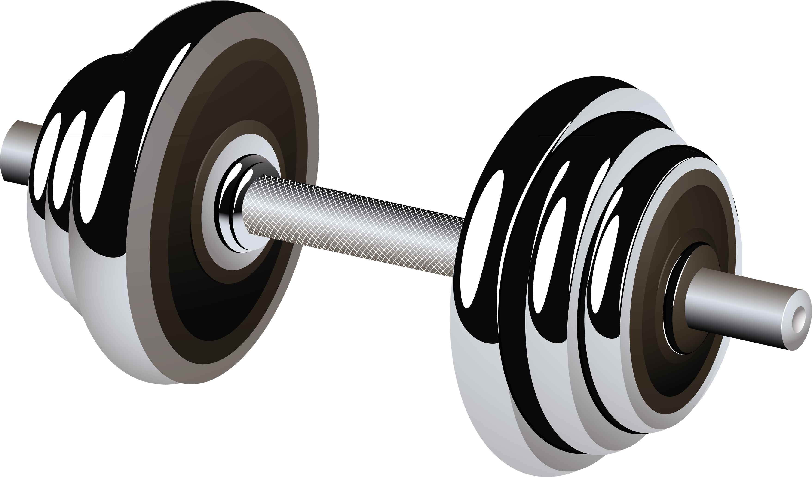

# TypeScript Fitness Tracker

### https://typescript-fitness-tracker.netlify.app/

## Fitness Tracker

- Keep track and store past workouts to watch your progress in the gym
- This app was built with React and TypeScript
- Future plans are to connect to MongoDB or utilize local storage

 

## Usage

### `npm install`

### `npm start`

Runs the app in the development mode. 
Open [http://localhost:3000](http://localhost:3000)

### `npm run build`

Builds the app for production to the `build` folder. 
